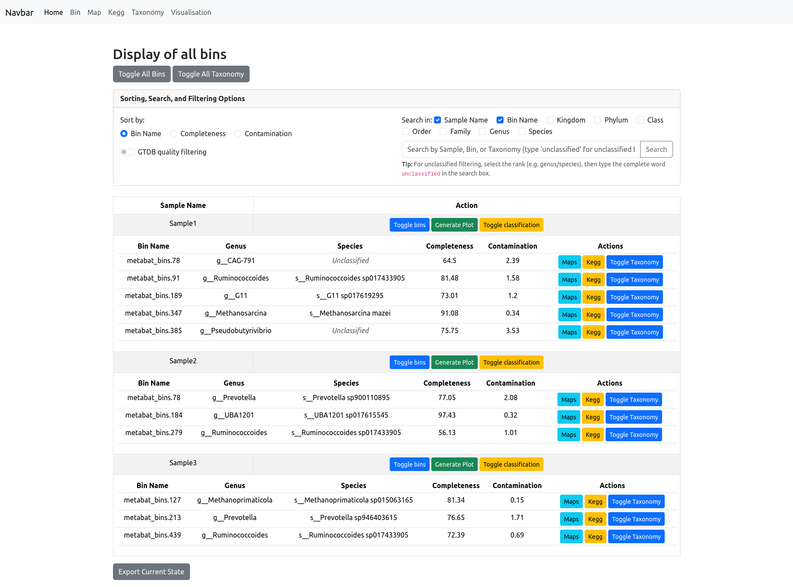

# Summary

[Pankegg](https://github.com/RVanDamme/PANKEGG) is an interactive software suite for parsing and visualising metagenome-assembled genomes (MAGs) and exploring their metabolic capabilities. It integrates quality metrics, annotation, and taxonomic classification in one interactive central database.
Pankegg enables researchers to explore, compare, and interpret their data through a modern browser-based interface, streamlining the analysis of large and complex metagenomic datasets. The software supports output from widely used tools such as CheckM2  [@Chklovski:2022], GTDB-TK [@Chaumeil:2020], Sourmash [@Brown:2016], and EggNOG [@Cantalapiedra:2021], making it a flexible solution for a wide range of microbiome and environmental genomics studies.
By interconnecting the different analysis results, people can investigate different interactions in the data more visually and conveniently. 
Pankegg answers questions such as:

- How many of my bins pass the GTDB [@Parks:2022] quality threshold?
- What is their taxonomic classification?
- Which KEGG orthologs are present?
- Which proportion of their respective metabolic pathways is covered by the  KEGG orthologs identified? 

Answering these questions typically requires inspecting multiple result files and cross-referencing the information. In contrast, Pankegg provides an all-in-one platform to explore, visualise, interpret, and save the results.

# Statement of need

The ever-growing progress of sequencing technologies has made it possible to recover thousands of draft and high-quality genomes directly from a plethora of environmental samples, accelerating our understanding of microbial diversity across ecosystems. Shotgun metagenomics with assembly-based approaches recovers metagenome-assembled genomes (MAGs), giving access to taxonomic and functional profiles of uncultured microorganisms.

Pankegg integrates taxonomic analysis with KEGG pathway annotations, distinguishing itself from tools like MAGFlow/BIgMAG  [@YepesGarcia2024] and Anvi'o [@Eren2021]. While MAGFlow/BIgMAG and Anvi'o metagenomics provide comprehensive metagenomic workflows and their visualisation, Pankegg focuses on the visualisation and the functional interpretation of orthologs' variations across multiple samples and bins within the context of KEGG pathways [@Kanehisa:2023]. Our focused approach on the KEGG orthologs facilitates a more direct and efficient analysis of metabolic capabilities and variations in microbial communities, even with growing datasets. 

As the volume and complexity of metagenomic data increase, so do the challenges of efficiently comparing and visualising results from diverse annotation, classification, and quality assessment tools. In just one year (April 2024 to April 2025), over 135,000 new genomes were added to the Genome Taxonomy Database (GTDB). 
Tools like CheckM2, Sourmash, GTDB-TK, and EggNOG provide key outputs for quality, taxonomy, and functional annotation, but downstream integration and visualisation remain non-trivial.

Pankegg enables users to merge results from any pipeline, workflow, or manual analysis that provides annotation, classification, and quality information into a standardised SQL database. The database allows users to explore the data through an interactive local web application. 
The tool is designed to analyse finalised metagenome-assembled genomes (MAGs) and critically evaluate bins obtained during the binning stage of assembly-based metagenomic analysis. By integrating CheckM2 quality metrics, annotation, and taxonomic classification, Pankegg helps users determine which bins meet the GTDB standards to be classified and reported as MAGs and which bins should be excluded due to low quality or inconsistency. Pankegg allows the user to explore and compare the metabolic capabilities of microbial communities.
 
Pankegg relies on widely used coding languages (Python, JavaScript, and HTML), SQLite as the SQL database engine [@sqlite], and libraries:

- flask [@flask]
- jinja2 [@jinja2]
- pandas [@reback2020pandas]
- numpy [@harris2020array]
- SciKit-Learn [@scikit-learn]
- SciPy [@virtanen2020scipy]
- click [@click]
- Python SQLite3 [@python-sqlite3]

Making its installation straightforward in most systems through pip [@pip], conda [@conda], and pixi [@pixi], see the Pankegg installation chapter in our documentation.
The software installation was tested on Ubuntu, WSL (Ubuntu 16 to 22), Windows 10 & 11, MacOS, and HPE Cray EX supercomputer systems.
This unified approach reduces the barriers to integrative metagenomic analysis, enabling both specialists and non-specialists to make informed decisions based on large-scale, genome-resolved metagenomic data.

# Tool Overview

Pankegg consists of two primary tools:

## PANGEGG MAKE DB

This script ingests a CSV file specifying the locations of EggNOG annotations, classification (Sourmash or GTDB-TK), and quality metrics (Checkm2) files for each sample. It then constructs an SQL database aggregating all relevant results.

## PANKEGG APP

The app is a Flask-based web server that connects to the SQL database generated by `pankegg_make_db.py`,  providing a simple interface for interfacing, cross-referencing, and filtering the data.
The interface offers many different information, and each page can be filtered by information from the other pages. A more detailed explanation is in our documentation's Pankegg Web Page chapter.
Here is a concise summary:

1. Bin page: outlines all bins/MAGs in the database. \autoref{fig:Figure1}
2. Pathway page, also called Map page: lists the pathways in the database. Each pathway contains a “completion value”. This indicator is calculated by dividing the number of KEGG orthologs in the user's database by the total number of orthologs in the pathway.  \autoref{fig:Figure2}
3. KEGG page: lists the KEGG orthologs in the data. The information for each ortholog is expandable, and the view then includes the corresponding EggNOG entries (bin ID, sample ID, GO terms, KEGG orthologs associated, EggNOG description).
4. Taxonomy page: presents the taxonomic composition of the input database.
5. The sample vs. Sample and Bins vs. Bins pages allow users to compare different samples or bins, respectively, with regard to pathway presence, completeness, and quality metrics.
6. PCA page: This page visualizes a principal component analysis (PCA) based on functional or taxonomic profiles. Beware that PCA interpretation is only valid with enough data; we recommend at least 40 bins [Shaukat2016173190]. 

Pankegg’s app is designed to make exploration intuitive. It features sortable and filterable tables, interactive plots, and external links to KEGG and other databases. These features collectively support users in hypothesis generation, genome curation, and discovering ecological and functional trends in complex datasets.

# Figures

# Author contribution

**Renaud Van Damme:** Conceptualisation and software development (initial version), supervision, software co-development (current version), testing, writing original draft, review, and editing.

**Arnaud Vanbelle:** Conceptualisation, software co-development (current version), testing, review, and editing.

**Juliette Hayer:** Methodology, advising on software development, testing, review, and editing.

**Amrei Binzer-Panchal:** Methodology, advising on software development, testing, review, and editing.

**Erik Bongcam-Rudloff:** Supervision, project administration, advising on software development, testing, review, and editing.

# Acknowledgements

Pankegg was initially conceived as a segment of the [MUFFIN pipeline](https://github.com/RVanDamme/MUFFIN) [@VanDamme2021] for metagenome-assembled genome analysis, and we thank the community for feedback and feature suggestions that made it a stand-alone tool.

We acknowledge the Swedish University of Agricultural Sciences Bioinformatics Infrastructure (SLUBI) for providing HPC resources to help develop Pankegg.

We acknowledge the “Studying abroad Erasmus+” programme of the European Union, which allowed Arnaud Vanbelle to exchange between the Haute École en Hainaut (HEH), Belgium, and the Swedish University of Agricultural Sciences for his Master's thesis. The European Commission's support does not endorse the publication's contents, which reflect the author's views. 

# References
